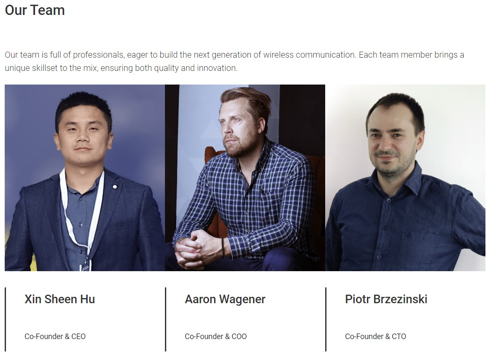
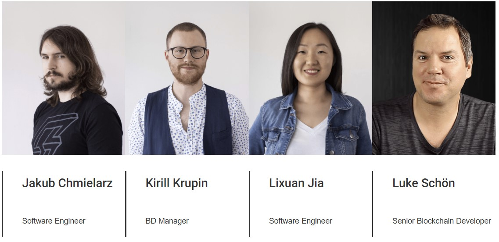

# MXC Overview

Hello there! Welcome to an *MXC Overview* in the MXC Handbook. This guide will provide an overview of MXC and MXC mining, and also take you through most of the steps, questions and answers you need to get started.

Are you brand new to MXC and/or MXC mining? Consider checking out the [MXC FAQ](MDFiles/Handbook/M2_FAQ.md) first. Do you have specific questions? Try the Search bar available on this page/menu to search a term in the whole MXC Handbook.

## What is MXC?
**MXC** stands for *Machine eXchange Coin* and is a cryptocurrency token (an [ERC20](https://www.investopedia.com/tech/why-crypto-users-need-know-about-erc20-token-standard/)  **utility token** to be exact). It is used for IoT (*Internet of Things*) device transactions conducted through [LPWAN](https://en.wikipedia.org/wiki/LPWAN) data networks. MXC adds value to LPWAN (also sometimes referred to as *LoRaWAN*) networks by giving the IoT and MXC communities a chance to share in IoT profits through mining, staking and IoT data-handling.

This introductory video from the MXC Foundation explains it well:

<iframe height="350" src="https://www.youtube.com/embed/7TYA6awG0j4" title="MXC coin explained" frameborder="0" allow="accelerometer; autoplay; clipboard-write; encrypted-media; gyroscope; picture-in-picture" allowfullscreen></iframe>

## What is the MXProtocol?
The **MXProtocal** is the protocol MXC (or MXC-enabled) IoT devices use to communicate with each other, efficiently and securely. It also allows the MXC token to be used in the network-sharing IoT cryptocurrency economy. For more information, see this introductory video:
<iframe height="350" src="https://www.youtube.com/embed/26mYsNw32YM" title="MXC Protocol Explained" frameborder="0" allow="accelerometer; autoplay; clipboard-write; encrypted-media; gyroscope; picture-in-picture" allowfullscreen></iframe>

## MXC is *mined* using the *M2 Pro miner*
Mining MXC is extremely easy. One just needs to purchase the M2 Pro miner, download the *DataDash* app, connect the miner to the Internet, and MXC mining starts immediately. From user reports, each miner earns from $10 - $14 USD worth of MXC per day. The manufacturer of the M2 Pro miner is **MatchX**, located in Berlin, Germany, and the M2 Pro miner can be shipped worldwide. One can purchase the M2 Pro miner directly from MatchX (or on Amazon for a bit more). For more information and to purchase the M2 Pro miner from MatchX, use this link [www.matchx.io](https://matchx.io/pages/m2-pro-miner).
(For a 50 euro discount at the matchx.io site, use **mxchandbook** as the Promo Code.)

<!-- Also, check out this video to see how easy it is to setup!
<iframe height="350" src="https://www.youtube.com/watch?v=aKNbnFIazfM" title="MatchX M2 Pro Miner Setup - Complete Tutorial" frameborder="0" allow="accelerometer; autoplay; clipboard-write; encrypted-media; gyroscope; picture-in-picture" allowfullscreen></iframe> -->

For a deeper dive into M2 Pro earnings, please read this MXC Foundation article: [M2 Pro Miner Earnings and What's Next](https://medium.com/mxc/insider-report-how-to-improve-your-m2-pro-mining-earnings-whats-next-4569fc931ac4).

Shipping times for the M2 Pro do vary, depending on locations and warehouse inventory, and have ranged from 2 - 10 weeks in 2021. Please ask in the [MXC Telegram](http://t.me/mxcfoundation) group to get the latest shipping times for your area, or look in the *#shipping* room in the [MXC Discord](jttps://mxc.news/mxcdiscord) group for up-to-date reports from users. 

## What is Miner Health?
*Miner Health* is the way to keep track of your M2 Pro miner's optimal MXC earning potential, in the DataDash app. Currently, by just keeping your M2 Pro:

- **Powered on**
- **Online** and 
- Allowing your **mined MXC to accumulate** as *Fuel*...

...you will be optimizing your M2 Pro's *health* and thus your miner's MXC earnings. In the future, other *Miner Health* criteria will be introduced which will impact Health and miner earnings if not optimized, and these include:

- **Elevation**
- **GPS signal stength**
- **Proximity to other M2 Pro miners** (more then 50 meters will be ideal), and 
- **Orientation** (i.e. keeping your miner upright). 

Check out [this](https://www.youtube.com/watch?v=r67ZV77U-TQ) YouTube video from MXC community member *The Nordic Moonshot*, for more information about Miner Health. Also, this article from the MXC Foundation should help: [M2 Pro Miner Health](https://blog.mxc.org/miner-health).

## Is there a Map of all the M2 Pros in the World?
Yes, you can find the MXC M2 Pro map here [www.mxcmapper.com](https://mxcmapper.com).  The blue dots on the map are the M2 Pro miners, and the grey dots are LoRaWAN gateways (which indicate where future IoT and MXC traffic, and thus earnings, might come from). The map is updated manually every two weeks or so.

## The M2 Pro miner is a Multi-Token miner
The M2 Pro was designed to be a multi-token/multi-coin miner. It currently mines MXC, provides a boost to [DHX (DataHighway) mining](http://dhxmining.com), and BTC (Bitcoin) mining is in [testnet](https://medium.com/mxc/dkp-testnet-analysis-report-data-valuation-discrepancy-insight-596218b9a385). DOT (Polkadot) mining is currently in planning and development.

## The App for the M2 Pro miner
The M2 Pro miner's app is called **DataDash** and you can download it for your Android phone or iPhone, from your phone's app store. It is also available at  [www.mxc.org/mxcdatadash](https://www.mxc.org/mxcdatadash).

## Smart Cities, MXC IoT Data-handling and Device Provisioning
As mentioned above, M2 Pro owners are currently mining and earning MXC (about $10-14 USD worth of MXC per day per miner, according to user reports from all over the world). And the IoT data-handling part of the MXC network -- a part that will provide additional income -- is ramping up to go live in the future. The installed M2 Pros **are already** sensing IoT/LoRaWAN traffic in their environments. MatchX, and their non-profit sister organization [The MXC Foundation](http://mxc.org), have been busy working with cities and companies to make Smart Cities, smart-machine bidding and IoT data-traffic processing a reality.

Recently, as part of the MXC Foundation's plans to roll out MXC adoption around the world, easy-to-use **IoT Device Provisioning** capabilities were launched to allow LoRaWAN IoT sensors to on-board MXC and the MXProtocol securely, easily and efficiently. If you are a city, business or individual, and you are interested in IoT and Smart City applications -- particularly in **monetizing** your IoT and Smart City applications -- then you can learn more about MXC's IoT Device Provisioning capabilities in this article: [MXC Focuses on Billion Dollar IoT Provisioning Sector](https://medium.com/mxc/mxc-focuses-on-billion-dollar-iot-provisioning-sector-7d4a53235f0b). For more information, the MXC Foundation can also be contacted directly at hello@mxc.org or through their website [http://www.mxc.org](http://www.mxc.org).

## How MXC stands apart
This table shows the differences between the different IoT projects out there, and how MXC compares:

| **Technology** | MXC | IOTA | Streamr | Helium
| - | - | - | - | - |
| **Tx Speed** | within 5s | minutes to hours | minutes to hours | within 5s |
| **Inter-chain data** | Yes | No | No | No |
| **Anti-collision** | Yes | No | No | No |
| **Smart-machine Bidding** | Yes | No | No | No |
| **Target group** | Small devices to   large machines | Powerful machines | Small devices to   large machines | Small Devices|
| **USP** | MXProtocol | Tangle | Data market | LongFi |
| **Total Supply** | 2,642,132,373 MXC | 2,779,530,283 MIOTA | 987,154,514 DATA (100% Circulating) | 223,000,000 (34% Circulating) |

## IoT Protocols
| **Technology** | LoRaWAN | 3G/4G/5G NB-IoT | Wi-Fi |
| - | - | - | - |
| **Network topology** | Decentralized star network | Centralized star network | Decentralized star network |
| **Target group** | All the industries | All the industries | End consumers |
| **Single Cell Capacity** | more than 60k | around 10k | less than 200 |
| **Maximum range** | 40km | 10km | 200m |
| **Battery life on AAA** | 5 years | 6 months | 3 months |
| **Licensed Frequency** | No | Yes | No |
| **GPS-free localisation** | Yes | Yes | No |

## MXC is Available on a few Cryptocurrency Exchanges

[Okex](https://www.okex.com/join/3966016) *Low Fees | High Liquidity | invite: 3966016*
 [Huobi](https://www.huobi.com/en-us/topic/welcome-bonus/?invite_code=jgy68) *Earn up to $170 welcome bonus! | invite: jgy68*- [HOO] [HOO](https://www.hoo.co/friends/26815795?localeLang=en&) *Buy both MXC and DHX | invite code: 26815795* (lowest fees)
 [Biki](https://www.biki.cc/en_US/register?inviteCode=WGTHEWT) *Buy both MXC and DHX | invite: WGTHEWT*

Check them out on one of these sites:
 [coingecko](https://www.coingecko.com/en/coins/mxc#markets)
 [coinmarketcap](https://coinmarketcap.com/currencies/mxc/markets/)

## Connect with the MXC Team and the Community

Probably the best way to get in contact with the MXC community is by using either the Telegram or Discord group discussion apps. Here are the invitation links to them for MXC: [MXC Telegram](https://t.me/mxcfoundation) or [MXC Discord](https://mxc.news/mxcdiscord).

If you need help with an M2 Pro order, sending an email to orders@matchx.io (with your order number) is your best bet.

If you need technical support from the MXC team, you should either open a support ticket on [**MXC Discord**](https://mxc.news/mxcdiscord) using the **/support** command in the **#help** room, or by sending an email to **support@matchx.io** (that will also open a support ticket).

## Staying Up-to-date and getting official MXC Announcements
- [MXC Official Announcements - Telegram](https://t.me/mxcofficialannouncements)
- [Twitter](https://twitter.com/MXCfoundation)
- [Medium](https://medium.com/mxc)

## A Simple MXC Mining chart
MXC mining is easy! This diagram describes it well:

## Setting up the M2 Pro over Wifi
Though you'll first need to setup the M2 Pro miner over an Ethernet cable (supplied with the miner), switching to WiFi is easy, as this video shows:
<iframe height="350" src="https://www.youtube.com/embed/U1jNl837CfE" title="M2 Pro wifi setup" frameborder="0" allow="accelerometer; autoplay; clipboard-write; encrypted-media; gyroscope; picture-in-picture" allowfullscreen></iframe>

## Where does the Money go?

## RoadMap

## The MXC Team

## The Data Economy in short

